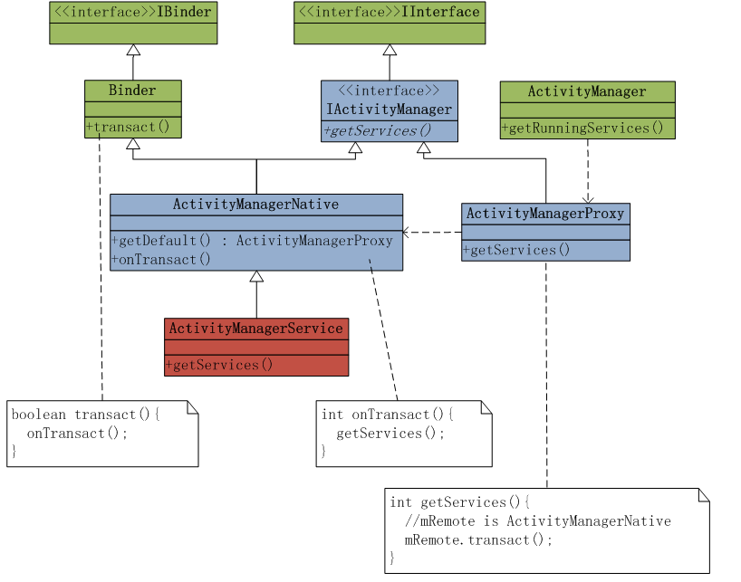

## Android 窗口管理服务WindowManagerService切换Activity窗口的过程分析
  - ActivityStack.startActivityLocked 方法进行切换操作，是否切换根据情况来定。

    if (!r.mLaunchTaskBehind && (taskForIdLocked(taskId) == null || newTask)) {// 最后的task 和 AMS 正在 进行任务。
          insertTaskAtTop(rTask);
          mWindowManager.moveTaskToTop(taskId);
    }
  - 在startActivityLocked的方法中 有较多的关于Activity栈的处理。

## AMS 调用架构
  - 代理模式
    - 代理类 和 被代理类共同实现一个类： IActivityManager.java 接口类
    - 代理类： ActivityManagerProxy 被代理类： ActivityManagerNative(操作)
    - Client : ActivityManager.java
  - 逻辑图：
  
  - AMS: [AMS大概分析](AMS.md)

## Activity窗口的四个按键（最大 最小 返回 关闭） 
  - Activity组件的UI是使用一个PhoneWindow对象来描述的。PhoneWindow:
      - PW继承 Window类，因此它可以保存Activity类的成员变量mWindow中。
  - 实现方案（模仿Openthos)
   **ActivityManagerNative.java中添加关闭的方法**

    public boolean closeActivity(int stackId) throws RemoteException {
        Parcel data = Parcel.obtain();
        Parcel reply = Parcel.obtain();
        data.writeInterfaceToken(IActivityManager.descriptor);
        data.writeInt(stackId);
        mRemote.transact(CLOSE_ACTIVITY_WITH_WINDOW_TRANSACTION, data, reply, 0);
        reply.readException();
        boolean[] ret = new boolean[1];
        reply.readBooleanArray(ret);
        data.recycle();
        reply.recycle();
        return ret[0];
    }

  **AMS extends AMN**

    @Override
    public boolean closeActivity(int stackId) {
              boolean succeed;
              long ident = Binder.clearCallingIdentity();
             StackInfo stack = getStackInfo(stackId);
               if (stack != null) {
                      for (int next = stack.taskIds.length - 1; next >= 0; --next) {
                             removeTask(stack.taskIds[next]);
                           }
                     succeed = true;
                  } else {
                           succeed = false;
                       }
               Binder.restoreCallingIdentity(ident);
              return succeed;
    }

  **PhoneWindow 中进行调用**

     mCloseBtn = (ImageButton)mDecorView.findViewById(com.android.internal.R.id.mwCloseBtn);
     mCloseBtn.setOnClickListener(new OnClickListener() {
         ...
         ActivityManagerNative.getDefault().closeActivity(getStackId());
         ...
     }

***

### 最后：
         对于最大化和最小化，其实都是一个逻辑。
