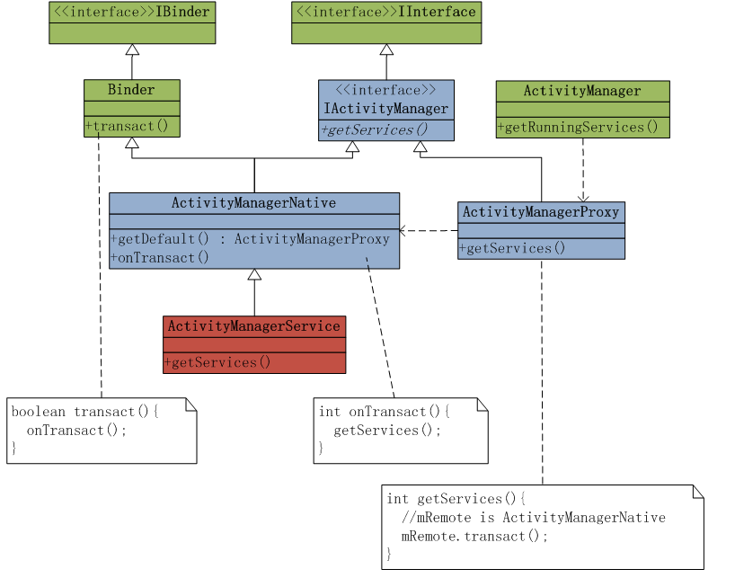

## ActivityManagerService（AMS） 源码分析
***
#### AMS 的简单介绍
* 1. AMS 由ActivityManagerNative（AMN）类派生，并实现Watchdog.Monitor 和 BatteryStatsImpl.BatteryCallback 接口。AMN是由IBinder派生。
* 2. AMS 是系统核心模块，负责系统中四大组件的启动、切换、调度及应用进程的管理和调度等工作.
* 3. 从系统运行角度看， AMS 可以分为Client端 和 Service端，Client: 运行各个app进程，Service: 运行SystemServer进程，是系统级别AMS的具体实现。
***
#### 主要涉及的类及位置
*  1.ActivityManagerService.java
*    services/core/java/com/android/server/am/ActivityManagerService.java
*  2.SystemServer.java
*    services/java/com/android/server/SystemServer.java
*  3.ActivityThread.java
*    core/java/android/app/ActivityThread.java
*  4.ActivityStack.java
*    services/core/java/com/android/server/am/ActivityStack.java
*  5.ProcessRecord.java
*    services/core/java/com/android/server/am/ProcessRecord.java
*  6.IActivityManager.java
*    core/java/android/app/IActivityManager.java
***
#### AMS 代码逻辑分析
*  1. 分析SystemServer中AMS的调用轨迹。
    **从main函数开始：**
    ```
    public static void main () {
        new SystemServer().run();
    }
    //run 方法中Start services；
    startBootstrapServices(){
    ....
        mActivityManagerService.setSystemProcess();
        //将SystemServer添加到AMS中被管理
        mActivityManagerService.initPowerManagement();
        //初始化Powerm
    ....
    }
    startCoreServices(){
    ...
        mActivityManagerService.setUsageStatsManager(
                LocalServices.getService(UsageStatsManagerInternal.class));
    ...
    }
    startOtherServices(){
    ...
        mActivityManagerService.installSystemProviders();
        //将SettingsProvider放到SystemServer进程中来运行
        mActivityManagerService.setWindowManager(wm);
        //保存wm窗口
    ...
    }

    ```
***
    AMS中重要函数：
    ```
        startHomeActivityLocked(int userId, String reason) {
            ...
            mStackSupervisor.startHomeActivity(intent, aInfo, reason);//启动Home
            ...
        }
        
        systemReady(final Runnable goingCallback) {
            systemReady函数完成了系统就绪的必要工作，然后它将启动Home Activity。至此，Android系统就全部启动了。
        }

    ```
***


***
[详细](http://blog.csdn.net/innost/article/details/47254381)
